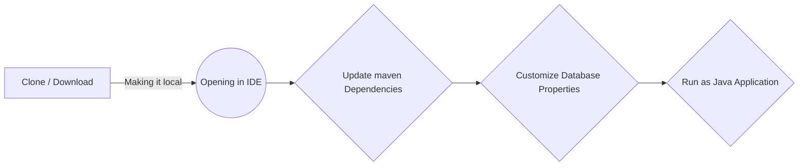

# Welcome to TB-5 Core Hibernate Project

Hi! Friends,

In this project, you will learn the basics of setting up hibernate project with SpringBoot and Spring JPA.

This is a very simple project in which we will only command-line interface to interact application so that we can give more focus on the important topics of hibernating and ORM-related features.

# Steps to run this application 

### 1. Clone this project
### 2. import / open project folder in your favorite IDE ( I'm using intelliJ Idea)
### 3. Update Maven dependencies
### 4. Edit Database Connection Properties as your configuration (I'm using PostgreSQL)
### 5. Run as Java Application 

	spring.datasource.url=jdbc:postgresql://localhost:5432/demo3
	spring.datasource.username=postgres
	spring.datasource.password=postgres
	spring.jpa.show-sql=true
	spring.jpa.hibernate.ddl-auto=create  
	# it is used in the development phase only
	## drop and re-create tables
	spring.jpa.properties.hibernate.dialect=org.hibernate.dialect.PostgreSQLDialect

**And this will produce a flow chart:**

